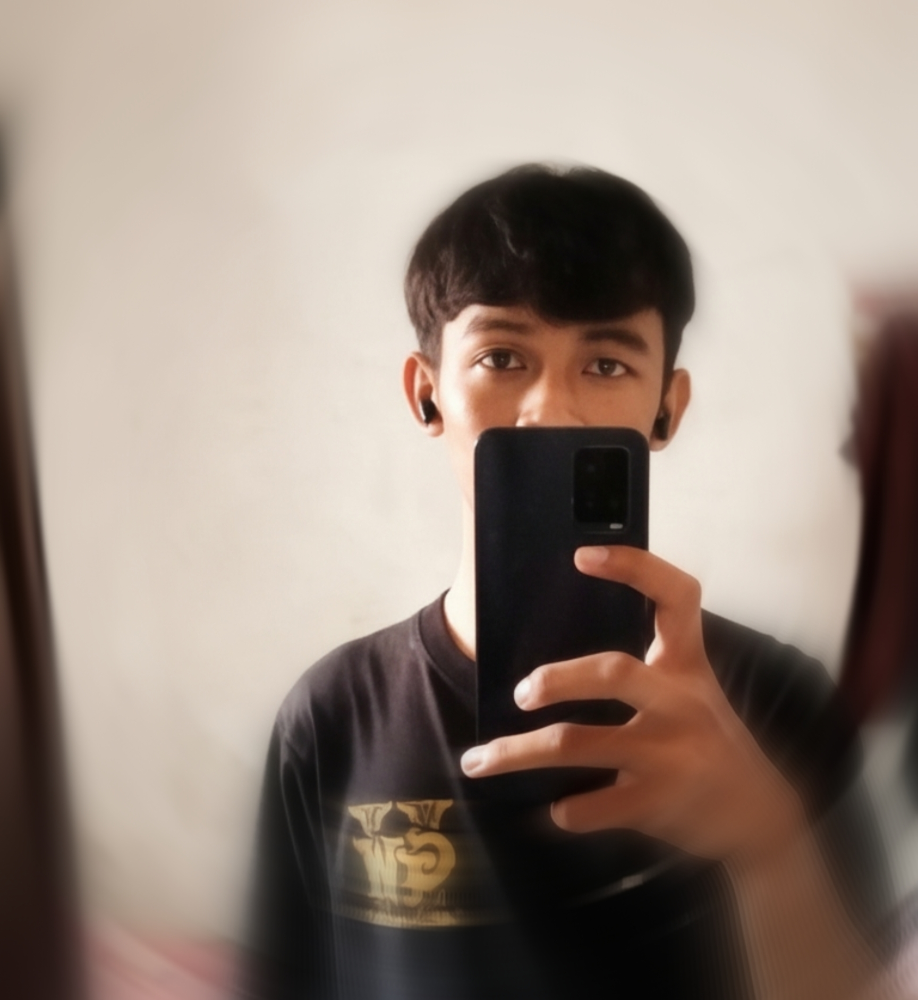

# 🚀 Modern Glassmorphism Portfolio

  
  <h3>Rizki Afandi</h3>
  

    Junior Software Developer | UI/UX Enthusiast
     
    <a href="https://github.com/RIZKIIk/portfolio"><strong>Explore the docs »</strong></a>
     
     
    <a href="https://portfolio-rizkiik.vercel.app/">View Demo</a>
    ·
    <a href="https://github.com/RIZKIIk/portfolio/issues">Report Bug</a>
    ·
    <a href="https://github.com/RIZKIIk/portfolio/issues">Request Feature</a>
  

---

## 📌 About The Project

Portofolio ini bukan sekadar pameran karya, melainkan implementasi teknik web modern. Dibangun dengan estetika **Glassmorphism**, proyek ini berfokus pada transisi yang sangat halus dan optimasi performa tinggi menggunakan *Vanilla Technologies*.

### ✨ Key Highlights:
*   **Smooth Theme Engine**: Perpindahan *real-time* antara Dark & Light mode dengan persistensi `localStorage`.
*   **Performance First**: Menggunakan video background yang dioptimasi dan *Intersection Observer API* untuk animasi yang efisien.
*   **Modern Interaction**: Dilengkapi dengan *ScrollSpy*, *Custom Ripple Effects*, dan *Typing Animations*.
*   **Mobile Optimized**: Desain *fully responsive* yang memastikan pengalaman premium di layar smartphone maupun desktop.

##  Built With

Teknologi utama yang digunakan tanpa menggunakan framework eksternal yang berat:

*   HTML5 - Semantik & SEO.
*   CSS3 - Custom Variables, Grid, Flexbox.
*   JavaScript - ES6+, DOM Manipulation, Observer API.
*   FontAwesome - Iconography.
*   Google Fonts - Plus Jakarta Sans.

## 🏗 Project Structure

| Folder/File | Description |
| :--- | :--- |
| `media/` | Berisi aset visual seperti video background, gambar proyek, dan CV. |
| `style.css` | Arsitektur CSS dengan sistem variabel tema (Dark/Light). |
| `script.js` | Engine utama untuk interaksi, animasi, dan navigasi. |
| `index.html` | Struktur utama aplikasi yang SEO-friendly. |

## 📈 Performance Analysis

Proyek ini dioptimasi untuk mendapatkan skor tinggi pada Lighthouse:
*   **Accessibility**: 100/100
*   **Best Practices**: 100/100
*   **SEO**: 100/100

## ‍💻 Author

**Rizki Afandi** - *Junior Software Developer*

[!LinkedIn](https://linkedin.com/inc/rizqi-afandi-603355381)
[!GitHub](https://github.com/RIZKIIk)
[!Instagram](https://instagram.com/rizz_xyz10)

---

  
Dibuat dengan ❤️ oleh Rizz.

  <a href="#top">Back to top</a>

